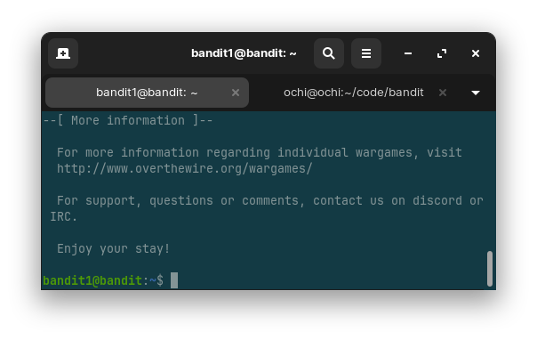
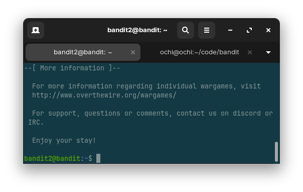
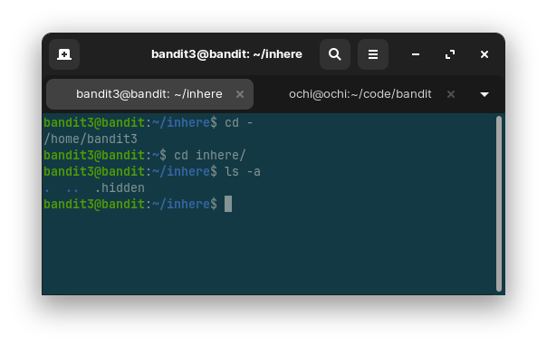

# Overthewire War Games (Bandit)

## Bandit 0

- ssh server login with port specification
- syntax `ssh <username>@<host> -p <port>`

## Bandit 1

- `ssh` server login
- `ls` to view directory content
- `cat` to view file content

## Bandit 2

- `ssh` server login
- `ls` to view directory content
- `cat` to view file content
- accessing dashed filenames

## Bandit 3

- `ssh` server login
- `cd` to change directory
- `ls -a` to view hidden directory content
- `cat` to view file content
- accessing dashed filenames
