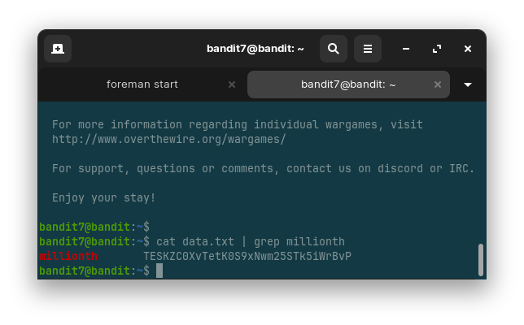
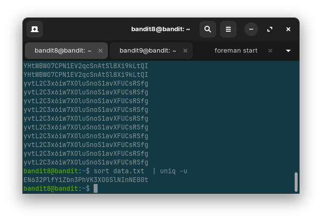

# Overthewire War Games (Bandit)

## Bandit 0

- ssh server login with port specification
- syntax `ssh <username>@<host> -p <port>`

## Bandit 1

- `ssh` server login
- `ls` to view directory content
- `cat` to view file content

## Bandit 2

- `ssh` server login
- `ls` to view directory content
- `cat` to view file content
- accessing dashed filenames

## Bandit 3

- `ssh` server login
- `cd` to change directory
- `ls -a` to view hidden directory content
- `cat` to view file content

## Bandit 4

- `ssh` server login
- `cd` to change directory
- `ls -a` to view hidden directory content
- `cat <path>/-filename` view dashed filenames

## Bandit 5

- `ssh` server login
- `cd` to change directory
- `find` search for files in a directory hierarchy
- `du` estimate file space usage
- `ls` list directory content
- `find -readable -type f ! -executable -exec du -b {} + | grep 1033` or `find -readable -type f ! -executable -exec ls -l {} + | grep 1033`

## Bandit 6

- `ssh` server login
- `cd` to change directory
- `find` search for files in a directory hierarchy
- `ls` list directory content
- `find -type f -size 33c -exec ls -l {} + | grep -E 'bandit6|bandit7'`

## Bandit 7

- `ssh` server login
- `grep` print lines that match patterns
- `grep data.txt | grep millionth`

## Bandit 8

- `ssh` server login
- `sort` sort lines of text files
- `uniq` report or omit repeated lines
- `sort data.txt  | uniq -u`

## Bandit 9

- `ssh` server login
- `strings` print the sequences of printable characters in files
- `grep` print lines that match patterns
- `strings data.txt | grep ===`
